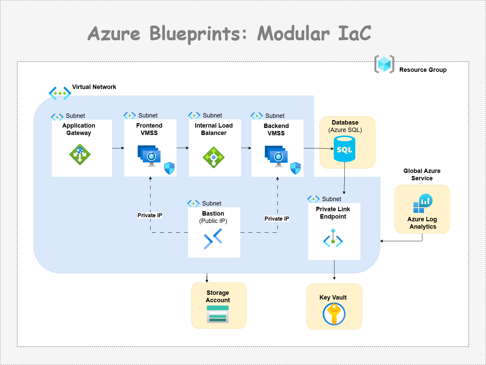

# Azure Enterprise Landing Zone: Modular Infrastructure

> Standardized foundation for VMSS deployments using Terraform.


## Project Structure

```text
VMSS_PROJECT/
├── environments/
│   ├── dev/
│   └── prod/
└── modules/
    ├── azurerm_application_gateway/
    ├── azurerm_bastion/
    ├── azurerm_compute/
    ├── azurerm_keyvault/
    ├── azurerm_log_analytics_workspace/
    ├── azurerm_networking/
    ├── azurerm_resource_group/
    ├── azurerm_sql_db/
    ├── azurerm_sql_server/
    └── azurerm_storage_account/
```

## Best-Practices
Parameterize only what varies
Avoid unreadable over-dynamic modules

## Note
Each VMSS gets its own subnet, LB backend pool and NAT pool